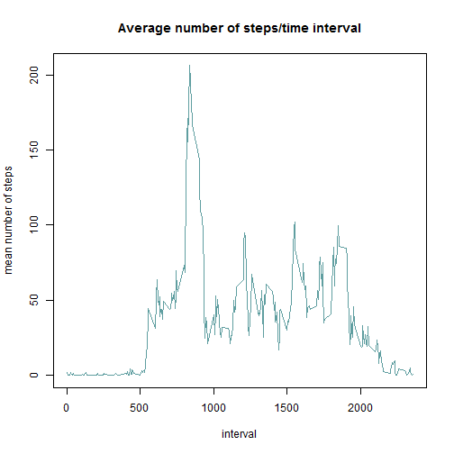
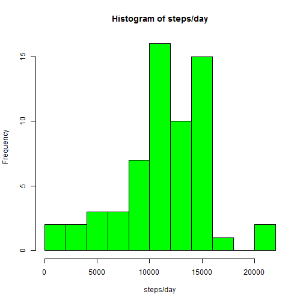

```r
setwd("//vll.se/users/M/MAFE09/Martin/Kurs reproducible research/Assignmnet 1")
library(dplyr)
```

```
## 
## Attaching package: 'dplyr'
## 
## The following object is masked from 'package:stats':
## 
##     filter
## 
## The following objects are masked from 'package:base':
## 
##     intersect, setdiff, setequal, union
```

```r
library(knitr)
library(xtable)

Activity <-  read.csv("activity.csv", header=TRUE)


tab1 <- tapply(Activity$steps, Activity$date, FUN =sum, na.rm=TRUE)

#tab1 <- Activity %>%select(steps, date) %>%
#  group_by(date) %>%
# summarize( sum_steps = sum(steps, na.rm=TRUE), N = length(steps))
```


```r
hist(as.numeric(tab1),nclass=8,col="cadetblue", xlab="steps/day", main="Histogram of steps/day")
```

 


```r
mean_steps <- mean(tab1,na.rm=TRUE)
median_steps <-  median(tab1,na.rm=TRUE)

central_steps <- data.frame(mean_steps, median_steps)

kable(central_steps,format = "markdown")
```


| mean_steps| median_steps|
|----------:|------------:|
|    9354.23|        10395|

```r
#taben <- xtable(central_steps)
#print(taben, type="html")
```


```r
tab1 <- tapply(Activity$steps, Activity$interval, FUN =mean, na.rm=TRUE)

plot(names(tab1),tab1,type="l",xlab="interval", ylab="mean number of steps", main="Average number of steps/time interval",col="cadetblue",lwd=1.5)
```

 


```r
tab2 <- tab1[order(tab1)]
max_interval <- names(tab2)[length(tab2)]
```

The 835 interval contains the maximum number of steps (across all days in the dataset)


```r
number_NA <-  nrow(Activity)- nrow(Activity[complete.cases(Activity),])
```

The total number of rows with NA are 2304


```r
tab1 <- tapply(Activity$steps, Activity$interval, FUN =mean, na.rm=TRUE) 
tab_sd <- tapply(Activity$steps, Activity$interval, FUN =sd, na.rm=TRUE) 

set.seed(211)
tab_miss <- rnorm(mean=tab1,sd=tab_sd,n=nrow(tab1))

tab_miss[tab_miss<0] <- 0

tab_miss <- data.frame(tab_miss,interval = names(tab1))

Activity_new <- merge(Activity, tab_miss, by.x="interval", by.y="interval")

for(i in 1:nrow(Activity_new)){
        if(is.na(Activity_new$steps[i]))
                Activity_new$steps[i] <- Activity_new$tab_miss[i]
                
}
```


```r
tab1_new <- tapply(Activity_new$steps, Activity_new$date, FUN =sum, na.rm=TRUE)

hist(as.numeric(tab1_new),nclass=8,col="green", xlab="steps/day", main="Histogram of steps/day")
```

 


mean_steps <- mean(tab1,na.rm=TRUE)
median_steps <-  median(tab1,na.rm=TRUE)

central_steps <- data.frame(mean_steps, median_steps)

kable(central_steps,format = "markdown")

```r
mean_steps <- mean(tab1_new,na.rm=TRUE)
median_steps <-  median(tab1_new,na.rm=TRUE)

central_steps <- data.frame(mean_steps, median_steps)

kable(central_steps,format = "markdown")
```


| mean_steps| median_steps|
|----------:|------------:|
|   11239.76|        11458|

The central tendency measures are higher when computed on the imputed dataset.
We can conclude that the imputation has a large positive impact on the central tendancy measures.

```r
Sys.setlocale("LC_TIME", "English") 
```

```
## [1] "English_United States.1252"
```

```r
Activity_new$weekdays <- weekdays(as.Date(Activity_new$date))

Activity_new$weekdays[Activity_new$weekdays=="Monday"] <- "weekday"
Activity_new$weekdays[Activity_new$weekdays=="Tuesday"] <- "weekday"
Activity_new$weekdays[Activity_new$weekdays=="Wednesday"] <- "weekday"
Activity_new$weekdays[Activity_new$weekdays=="Thursday"] <- "weekday"
Activity_new$weekdays[Activity_new$weekdays=="Friday"] <- "weekday"
Activity_new$weekdays[Activity_new$weekdays=="Saturday"] <- "weekend"
Activity_new$weekdays[Activity_new$weekdays=="Sunday"] <- "weekend"

Activity_new$weekdays <-as.factor(Activity_new$weekdays)
```


```r
Activity_new_weekday <- Activity_new[Activity_new$weekdays=="weekday",]
tab_weekday <- tapply(Activity_new$steps, Activity_new$interval, FUN =mean, na.rm=TRUE)

Activity_new_weekends <- Activity_new[Activity_new$weekdays=="weekend",]
tab_weekend <- tapply(Activity_new_weekends$steps, Activity_new_weekends$interval, FUN =mean, na.rm=TRUE)

par(mfrow=c(2,1))

plot(names(tab_weekday),tab_weekday,type="l",xlab="interval", ylab="mean number of steps" ,col="cadetblue",lwd=1.5,main="weekdays")
plot(names(tab_weekend),tab_weekend,type="l",xlab="interval", ylab="mean number of steps" ,col="cadetblue",lwd=1.5,main="weekends")
```

 

